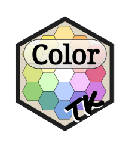

<!-- README.md is generated from README.Rmd. Please edit that file -->

```{r, include = FALSE}
knitr::opts_chunk$set(
  collapse = TRUE,
  comment = "#>",
  fig.path = "man/figures/README-",
  out.width = "100%"
)
```

# ColorTK <a href='https://nchanard.github.io/ColorTK/'></a>

<!-- badges: start -->
[](https://github.com/NChanard/ColorTK/actions/workflows/R-CMD-check.yaml)
[](https://app.codecov.io/gh/NChanard/ColorTK?branch=master)
<!-- badges: end -->

Set of colour manipulation tools.

## Installation

You can install the development version of ColorTK from [GitHub](https://github.com/) with:

``` r
devtools::install_github("NChanard/ColorTK")
```

## Documentation  

[ColorTK](https://nchanard.github.io/ColorTK/)
